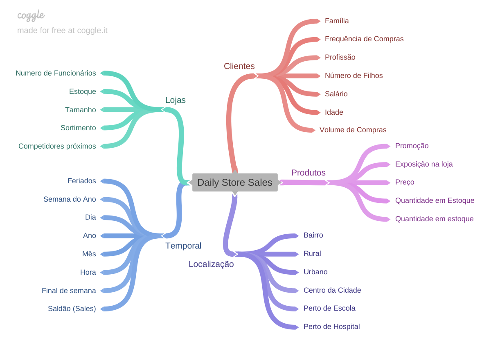

# DS_Producao_Rossmann

## O Problema de negócio

O CFO da Rossmann, uma das maiores cadeias de drogarias da europa, pretende realizar uma reforma nas mais de 1000 unidades de farmácias que fazem parte do grupo.
Para financiar as obras, ele pretende destinar uma parcela da receita de cada uma das unidades.

Para ter mais acertividade e eficiência na alocação dos recursos financeiros, o CFO solicitou que fosse realizada uma previsão das vendas para as próximas 6 semanas, para dessa forma, determinar o orçamento destinado a cada uma das lojas.

## Estratégia para resolução do problema de negócio

De forma a ter uma primeira solução para esta demanda e entregar valor para o time de negócio de forma mais ágil, foi utilizado o método CRISP_DS (Cross Industry Standard Process for Data Science) de desenvolvimento.

O método CRISP é uma forma cíclica de solucionar o problema que permite ter uma visão ampla da solução, ajuda a organizar os pensamentos e códigos de forma simples e direta e a ter mais celeridade na entrega de valor. Através dessa metodologia, é seguido um pipeline de 10 passos em cada ciclo de desenvolvimento e, após entregar o primeiro lote de valor, você pode iterar novamente, encontrar novos insights, ajustar parâmetros, melhorar a precisão e fornecer mais valor. O ciclo pode ser repetido quantas vezes forem necessárias.

## O método CRISP_DS no desafio da Rossmann

### 1 - Questão de negócio

Qual será o valor das vendas de cada loja do grupo Rossmann nas próximas 6 semanas?

### 2 - Entendimento do negócio

- **Motivação**: 
a previsão de vendas foi requisitada pelo CFO da Rossmann em uma reunião mensal sobre os resultados das lojas que fazem parte do grupo.

- **Causa raiz do problema**: 
dificuldade em determinar o valor do investimento para a reforma de cada loja.

- **Dono do problema**: 
Diretor financeiro (CFO) da Rossmann

- **Formato da solução**:
Previsão de vendas para as próximas 6 semanas
Ferramentas: Jupyter Notebook, Python, séries temporais/regressão
Formato da entrega: valor total das vendas/loja nas próximas 6 semanas com possibilidade de acesso via web.

### 3 - Coleta dos dados

Os dados foram obtidos no Kaggle e podem ser acessados [aqui](https://www.kaggle.com/c/rossmann-store-sales/data)

### 4 - Limpeza e Descrição dos dados

De forma a entender o quão desafiador era o problema a ser resolvido, após a coleta dos dados foi iniciado o processo de limpeza e descrição dos dados.

 - **Quantidade de dados**: foi verificado o tamanho do dataset para que pudessem ser escolhidas as melhores ferramentas de processamento e avaliados a quantidade de memória e processamento necessários para esse conjunto de dados.
 
 - **Tipos de variáveis**: conhecer os tipos de variáveis presentes no dataset e a porcentagem de cada uma, ajuda a nos guiar sobre quais técnicas são mais adequadas para o desenvolvimento do projeto.
 
 - **Tratamento de dados faltantes**: nessa etapa foi verificada a quantidade de dados faltantes no dataset e feita uma avaliação dos possíveis motivos de faltarem esses dados. A partir dessa avaliação, algumas premissas foram assumidas para que eles fossem devidamente preenchidos ou deletados.
 
 - **Estatística descritiva**: para ter uma noção mais geral dos dados, foram avaliadas algumas métricas descritivas das variáveis numéricas como média, mediana, range, máximo, mínimo, desvio padrão. Foram plotados gráficos apropriados para melhor visualiação do comportamento dessas variáveis. O comportamento das variáveis categóricas também foi avaliado através de gráficos e boxplots.
 
 - **Feature Engineering**: para facilitar a etapa de Análise Exploratória (EDA - Exploratory Data Analysis), algumas features foram decompostas para criação de outras, mais simples e fáceis de serem acessadas.
 
 ### 5 - Análise Exploratória dos dados
 
Como estamos trabalhando com uma metodologia cíclica de desenvolvimento, é esperado que essa análise possa ser refinada a cada iteração. Para que ficasse mais claro o nível de detalhamento que seria necessário nesse primeiro ciclo, foi construído um mapa mental de hipóteses. Através desse mapa, ficou mais fácil de entender quais as hipóteses poderiam ser criadas e quais as análises deveriam ser feitas para validá-las.

Abaixo estão algumas das hipóteses levantadas a partir do mapa mental e o resultados das análises realizadas para validá-las ou rejeitá-las.

